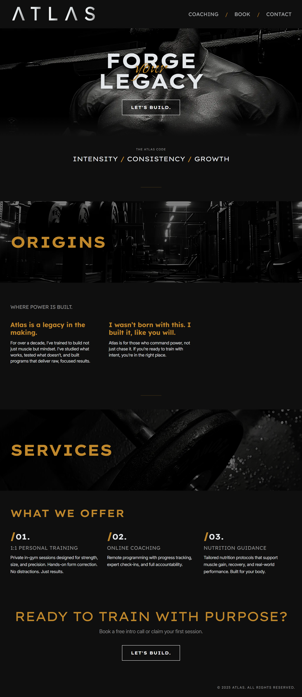

# Atlas

**Forge Your Legacy**

Atlas is a website for a personal trainer who specialises in muscle-building coaching. Designed to feel hardcore yet modern, Atlas targets male bodybuilders and individuals committed to serious training. Built with Next.js, Tailwind, and Cal.com booking integration. Designed with Swiss graphic design principles in mind.

## 🧱 Built With

    
    
    

[Next.js](https://nextjs.org/) – React Framework for fast static and server-rendered sites  
[Tailwind CSS](https://tailwindcss.com/) – Utility-first CSS for responsive styling  
[Cal.com](https://cal.com/) – Embedded calendar for bookings  

  

## 🚀 Features

- **Bold, Editorial Design:** Swiss-style layouts, bold typography, and gritty visual balance  
- **Integrated Booking System:** Custom frontend powered by Cal.com  
- **Responsive Layout:** Optimised for all devices  
- **Accessible & Performant:** Clean code and semantic HTML  

## 🔗 Link to Deployed Site

👉 [https://atlas-training.vercel.app/](https://atlas-training.vercel.app/)